# Gamer's Corner

Mock-up images

[Link to project](https://)

Gamer's corner is a fictional website and were created for educational purposes. <mark>The website is a club for gamers that are interested in playing pc-games with others. The site consists of XX pages to meet the owner and user goals of which are described in the UX-section.</mark>

## Table of contents

- [UX](#ux)

- [Features](#features)

- [Technologies](#technologies)

- [Testing](#testing)

- [Deployment](#deployment)

- [Credits](#credits)

## UX

### Project goals

The goal of Gamer's Corner is to create an friendly online community where PC gamers can connect over shared interests. By providing a platform for users to sign-up for events, the site promote friendships and collaboration among gamers. Gamer's Corner aims to enhance the gaming experience by making it easier for players to discover, participate in, and enjoy events.

### Site owner's goals

- Increase attendance at game nights events.

- Involve attendees in deciding which games to play.

- Easy administration.

### External user goals

- Information about upcoming game nights.

- Information on event details.

- Sign-up to game nights via a form.

### User stories

#### As a site owner

- I want to increase attendence to game nights.

- I want to send invitations to the attendees via email for easy administration.

#### As a user

- I want easy navigation, a responsive design across devices and a user-friendly interface to avoid frustration when trying to find information.

- I want to find information about upcoming game nights to know whether I can attend.

- I want to see information about what games will be played at each event to decide if I want to attend.

- I want to sign-up for game nights through a form for the events that interest me.

- I want to see high-quality pictures of the games.

- I want to send a message to the site's owner so that I can ask questions about upcoming events or games.

### Features

#### Key-features to meet the goals

- To ensure a responsive design and user-friendly interface, I will apply a mobile-first approach.

- There will be on or more clear call-to-action button on the first and second page for easy accesability which will lead to the sign-up form.

- There will be a section on the home page contatining information about the events.

- There will be an easy accesible navigation bar in the browser and a hamburgermenu on phone and tablet in the upper right corner for easy access and recognition for the user on all pages.

- There will be a separate page (_Games_) where users can vote for the top three games of the upcoming week, as well as a gallery with high-quality pictures and informative text of all the games that they can vote for.

- There will be a third page (_Sign-up_) to access a sign-up form. The sign-up form will have a field where the users must enter their email for easier administration by the site owner.

- The contact information will be placed in the footer for inquiries.

### Wireframes

#### Phone

- [Home](./docs/wireframes/wireframe_gamerscorner_home_phone.png)
- [Games](./docs/wireframes/wireframe_gamerscorner_games_phone.png)
- [Sign-up](./docs/wireframes/wireframe_gamerscorner_signupform_phone.png)
- [Welcome](./docs/wireframes/wireframe_gamerscorner_welcome_phone.png)
- [404](./docs/wireframes/wireframe_gamerscorner_404_phone.png)

#### Tablet

- [Home](./docs/wireframes/wireframe_gamerscorner_home_tablet.png)
- [Games](./docs/wireframes/wireframe_gamerscorner_games_tablet.png)
- [Sign-up](./docs/wireframes/wireframe_gamerscorner_signupform_tablet.png)
- [Welcome](./docs/wireframes/wireframe_gamerscorner_welcome_tablet.png)
- [404](./docs/wireframes/wireframe_gamerscorner_404_tablet.png)

#### Browser

- [Home](./docs/wireframes/wireframe_gamerscorner_home_browser.png)
- [Games](./docs/wireframes/wireframe_gamerscorner_games_browser.png)
- [Sign-up](./docs/wireframes/wireframe_gamerscorner_welcome_browser.png)
- [Welcome](./docs/wireframes/wireframe_gamerscorner_welcome_browser.png)
- [404](./docs/wireframes/wireframe_gamerscorner_404_browser.png)

#### Design choices

The overall intended feeling of the website is supposed to be an inviting and cozy-gaming atmosphere. The following design choices for this project was made with this in mind.

**Color palette**

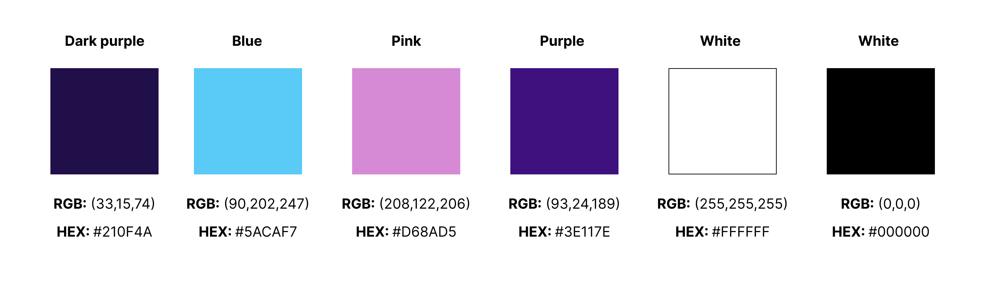

**Contrast checker**

- Changed the light pink to a lighter shade since is didn't pass the contrast checker with the dark purple. From #D07ACE to #D68AD5.

- I also decided to change the purple color to a darker shade since it only worked with the white color. Now it works with the blue shade as well. From #5D18BD to #3E117E.

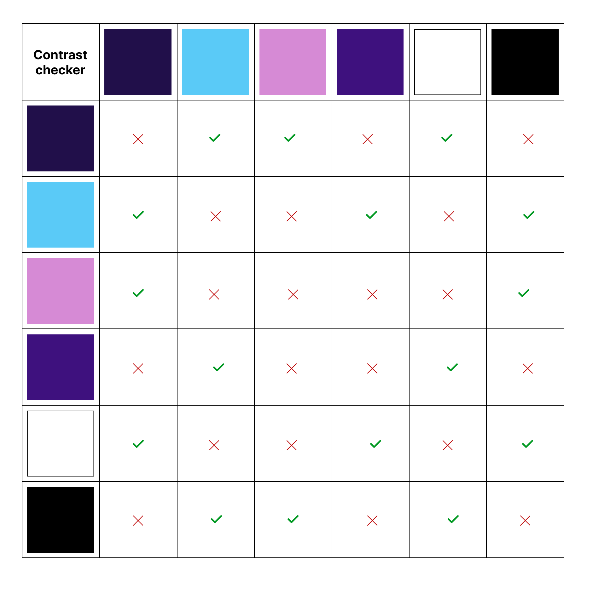

**Fonts**

- The fonts for all h1 elements are Passion One, for other heading elements Roboto Mono, and for the body text Titillium Web. I chose these three because they complement each other and create a dynamic trio. The choices were also made with the idea that they could reflect elements of gaming.

- <mark>As back-up fonts I chose XX for h1 elements, XX for other heading elements and XX for body text. </mark>

**Backgrounds**

**Styling**

---

## Technologies

---

## Testing

### Lighthouse

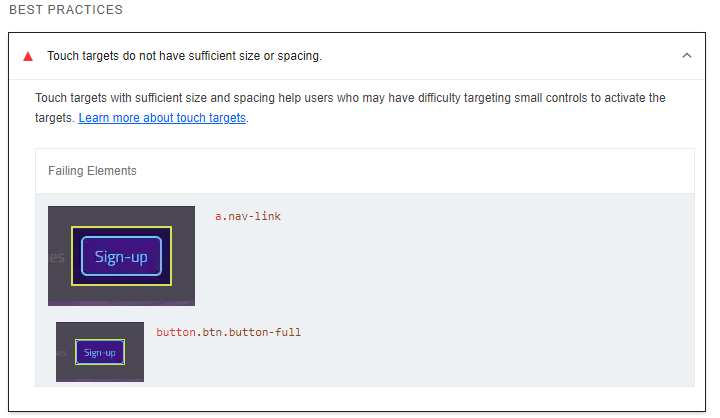

- While lighthouse testing there wasn't enough spacing around the buttons so I decided to make it larger to increase the area.

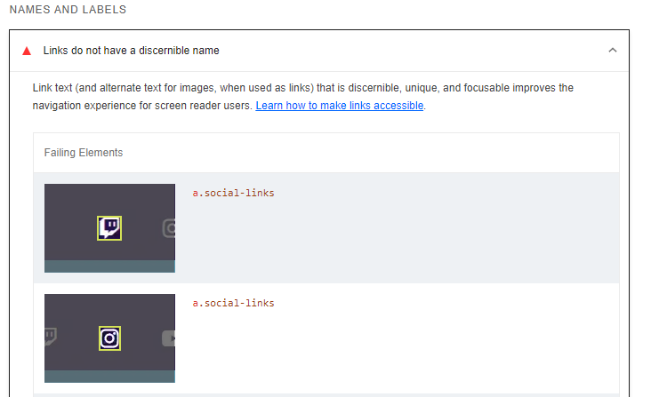

- I missed to add aria-labels to the social links since they don't have any other explanation other than the link text.

### Bugs

**Containers and rows in footer**

- when creating the footer, I had some trouble with how the containers and rows worked together with bootstrap grid. I added a background color to each of the container and rows to sort them out. It was also difficult to add all the col's, gap's and apply margins and paddings but in the end I worked it out.

**Caption text**

- I had troubles with the caption text disappearing on small devices on the carousel. Turned out to be a couple of classes that needed to be changed. I erased the d-none and md so it just says d-block to keep the block but not the grid properties (see the marked part on the second image).

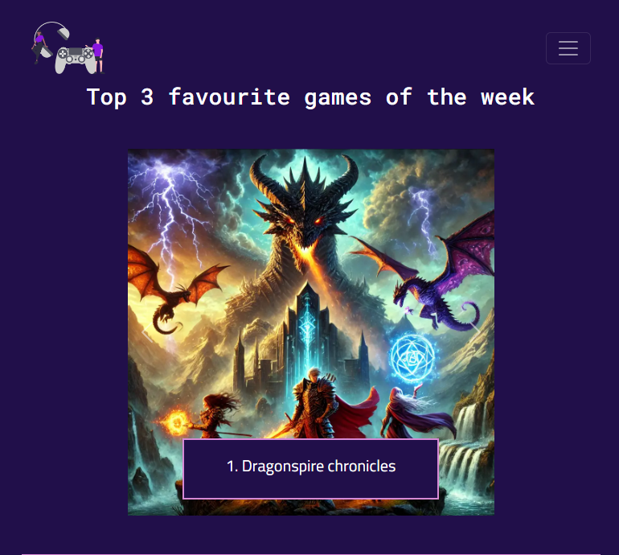

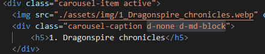

**Gap on cards**

-When I tried to give the cards on the game page a gap they didn't work how I thought they would. Instead of gap the third column was moved to the next row. To solve this, I found on Bootstrap that they need to be in another div with just the column properties.

_Problem_

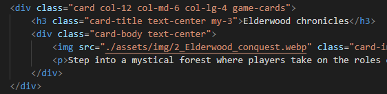

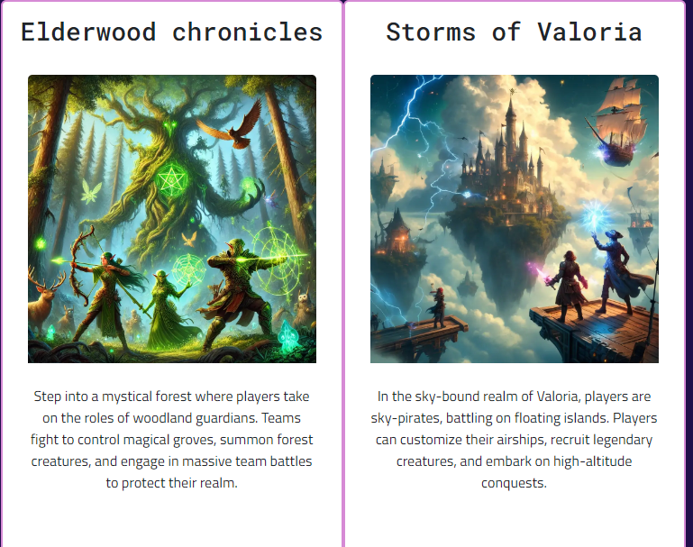

_Solution_

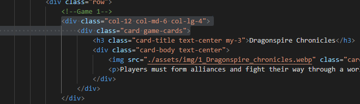

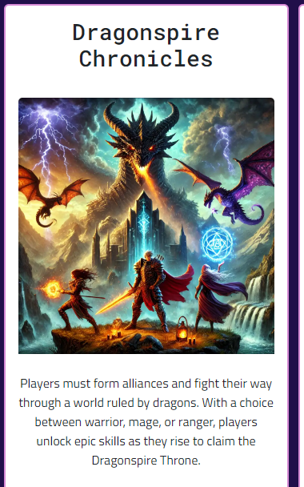

---

## Deployment

- when I were done with the index.html I added all the remaining changes, committed and pushed to GitHub. I decided to deploy early since it's recommended from the tutorials provided by the Code Institute. It's easier to compare both the local and the live to discover bugs or other problems early.

1. First step was to add, commit and push everything to GitHub.

2. Second step was to go to the repositories site and press on settings.

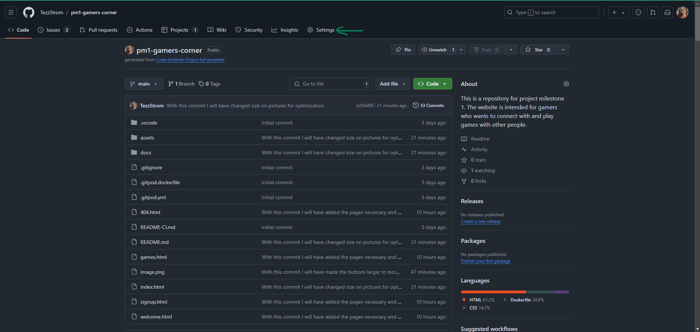

3. Third step was to press the pages in the left panel.

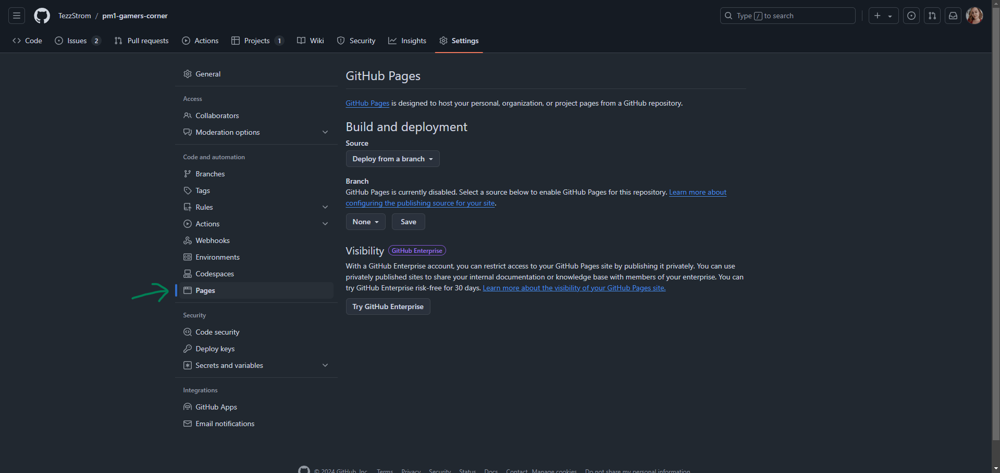

4. Fourth step was to chose source (deploy from branch) and then choose main and save.

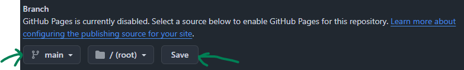

5. Step five was to go in to the actions tab and wait for it to finish processing.

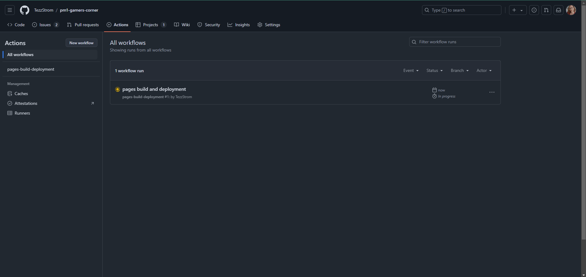

6. Step six was to go back to the <>code page, find the deployed site and press the link.

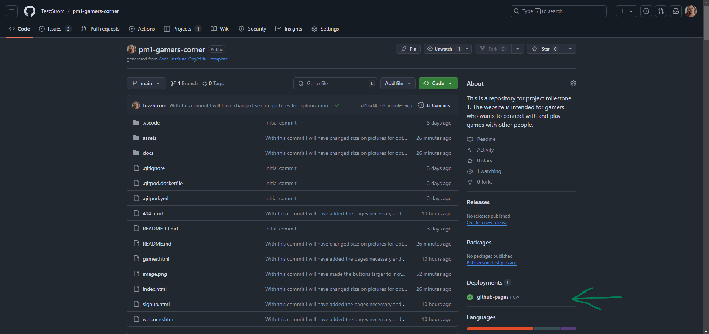

7. Step seven was to click the link to ensure that the link works and that everything looks good (which it did).

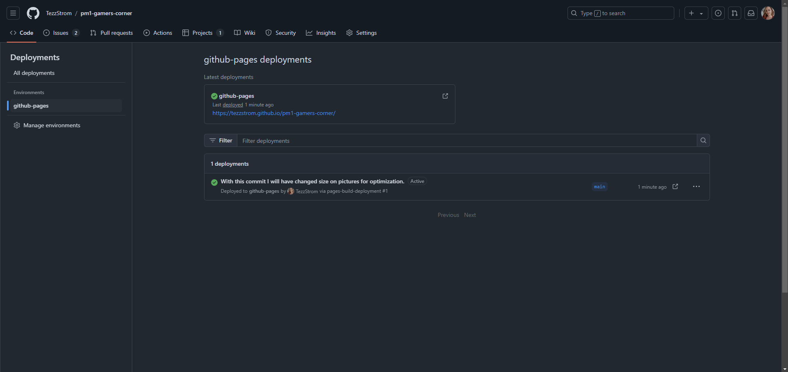

---

## Future improvements

- After talking to my mentor, we decided that I should leave out the vote function (see wireframes games page) since I have yet to learn the functionality behind that type of data. I would like to implement it later though because of the improved UX, the user is involved in decision making about what games to play.

---

## Credits

### Tools

| Source                                                                             | Location                                 | Type                            | Notes                                                                                      |
| ---------------------------------------------------------------------------------- | ---------------------------------------- | ------------------------------- | ------------------------------------------------------------------------------------------ |
| [Code Institute](https://codeinstitute.net/se/)                                    | Project plannig, syntax and git commands | -                               | How to build the entire website and how to use git.                                        |
| [GitHub Docs](https://docs.github.com/en)                                          | Readme.md, commit messages               | Syntax                          | How to write markdown                                                                      |
| [Balsamiq](https://balsamiq.com/)                                                  | GitHub                                   | Wireframes                      | Tool for creating wireframes which are linked in the README.md file                        |
| The element of user experience by Jesse James Garrett (2nd edition)                | Planning/design                          | Book                            | Used the book to read more about the five planes                                           |
| [Stackoverflow](https://stackoverflow.com/)                                        | README.md                                | Syntax                          | How to make bold text in markdown, found the right formatting later in GitHub Docs.        |
| [Image color picker](https://imagecolorpicker.com/)                                | Colors                                   | Color picker                    | This tool was used to choose colors for the color palette.                                 |
| [WEBAIM, web accessability in mind](https://webaim.org/resources/contrastchecker/) | Colors                                   | Contrast checker                | This tool was used to ensure that colors has a high enough contrast for visually impaired. |
| [Figma](https://www.figma.com/)                                                    | Colors                                   | Color palette, contrast checker | This tool was used to create a color palette and a table of the contrast checker.          |
| [Fontjoy](https://fontjoy.com/)                                                    | Fonts                                    | Font-generator                  | Used to produce fonts for the website.                                                     |
| [Google fonts](https://fonts.google.com/)                                          | Fonts                                    | Embedded code                   | Used to get embedded code for the fonts.                                                   |
| [Bootstrap](https://getbootstrap.com/)                                             | Elements/Syntax                          | -                               | For responsive design and elements, see comments in code.                                  |
| [Tinify](https://tinypng.com/)                                                     | Images                                   | Compress images                 | This tool was used to compress images for optimization.                                    |

### Media

| Source                                   | Location                    | Type                   | Notes                                                                    |
| ---------------------------------------- | --------------------------- | ---------------------- | ------------------------------------------------------------------------ |
| [Freepik](https://www.freepik.com/)      | images, portrait            | images                 | This website was used to download images to the site.                    |
| [Font awesome](https://fontawesome.com/) | Icons/Head icon             | Icons                  | Used to insert icons.                                                    |
| [UnDraw](https://undraw.co/search)       | Logo                        | Image                  | Used UnDraw to find a logo.                                              |
| [Unsplash](https://unsplash.com/)        | hero background             | Image                  | Used UnDraw to find a logo.                                              |
| [ChatGPT](https://chatgpt.com/)          | game images and description | Images and description | To produce the images and the description for the games, I used ChatGPT. |

### Challenges

| Source                                                                                                                    | Location   | Type                                   | Notes                                                                                                |
| ------------------------------------------------------------------------------------------------------------------------- | ---------- | -------------------------------------- | ---------------------------------------------------------------------------------------------------- |
| [Youtube](https://www.youtube.com/watch?v=qVvcPoAj_-w)                                                                    | git        | git reset --hard <SHA>                 | I accidentally copied the wrong SHA so I followed this tutorial to undo the reset.                   |
| [Stackoverflow](https://stackoverflow.com/questions/35868756/how-to-make-bootstrap-cards-the-same-height-in-card-columns) | Cards      | Height                                 | To make the cards on the game page the same height I used align-items-stretch from Stackoverflow.    |
| [Youtube (Kevin Powell)](https://www.youtube.com/shorts/hk3RgcBx5Fc)                                                      | a-tag link | Scroll down to section from other page | I used this video to figure out how to scroll down the index.html from an a-tag on the welcome page. |
