# Gamer's Corner

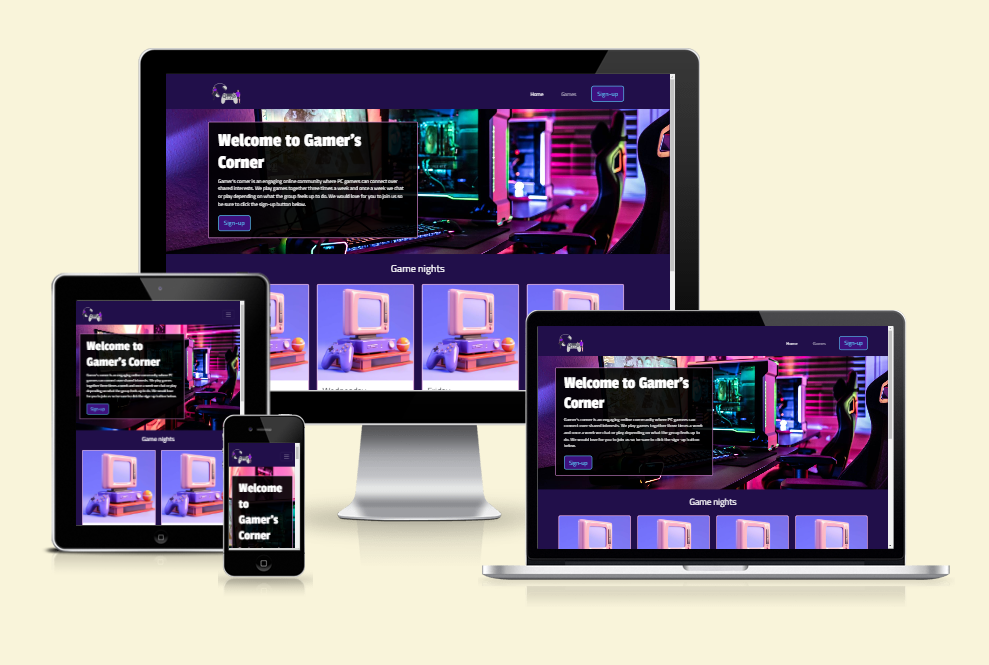

[Link to project](https://tezzstrom.github.io/pm1-gamers-corner/)

Gamer's corner is a fictional website and were created for educational purposes. The website is a club for gamers that are interested in playing pc-games with others. The site consists of 4 pages (plus a 404 page) to meet the owner and user goals of which are described in the UX-section.

## Table of contents

- [UX](#ux)

  - [Project goals](#project-goals)

  - [Site owner's goals](#site-owners-goals)

  - [External user goals](#external-user-goals)

  - [User stories](#user-stories)

  - [Wireframes](#wireframes)

  - [Design choices](#design-choices)

- [Features](#features)

  - [Key-features to meet the goals](#key-features-to-meet-the-goals)

- [Technologies](#technologies)

  - [Tools](#tools)

- [Testing](#testing)

  - [Validation](#validation)

  - [Lighthouse](#lighthouse)

  - [Manual-testing](#manual-testing)

  - [Browser-testing](#browser-testing)

  - [User-story testing](#user-story-testing)

  - [Bugs](#bugs)

- [Deployment](#deployment)

- [Future improvements](#future-improvements)

- [Credits](#credits)

  - [Media](#media)

  - [Challenges](#challenges)

## UX

### Project goals

The goal of Gamer's Corner is to create an friendly online community where PC gamers can connect over shared interests. By providing a platform for users to sign-up for events, the site promote friendships and collaboration among gamers. Gamer's Corner aims to enhance the gaming experience by making it easier for players to discover, participate in, and enjoy events.

### Site owner's goals

- Increase attendance at game nights events.

- Easy administration.

### External user goals

- Information about upcoming game nights.

- Information on event details.

- Sign-up to game nights via a form.

### User stories

#### As a site owner

- I want to increase attendence to game nights.

#### As a user

- I want easy navigation, a responsive design across devices and a user-friendly interface to avoid frustration when trying to find information.

- I want to find information about upcoming game nights to know whether I can attend.

- I want to see information about what games will be played at each event to decide if I want to attend.

- I want to sign-up for game nights through a form for the events that interest me.

- I want to see high-quality pictures of the games and read descriptions.

- I want to send a message to the site's owner so that I can ask questions about upcoming events or games.

### Features

#### Key-features to meet the goals

- To ensure a responsive design and user-friendly interface, I will apply a mobile-first approach.

- There is one or more clear call-to-action button on the first and second page for easy accesability which will lead to the sign-up form.

- There are a section on the home page contatining information about the events.

- There is an easy accesible navigation bar in the browser and a hamburgermenu on phone and tablet in the upper right corner for easy access and recognition for the user on all pages.

- There is a separate page (_Games_) where users can vote for the top three games of the upcoming week, as well as a gallery with high-quality pictures and informative text of all the games that they can vote for.

- There is a third page (_Sign-up_) to access a sign-up form. Here, users can sign up to game nights.

- The contact information is placed in the footer for inquiries.

### Wireframes

#### Phone

- [Home](./docs/wireframes/wireframe_gamerscorner_home_phone.png)
- [Games](./docs/wireframes/wireframe_gamerscorner_games_phone.png)
- [Sign-up](./docs/wireframes/wireframe_gamerscorner_signupform_phone.png)
- [Welcome](./docs/wireframes/wireframe_gamerscorner_welcome_phone.png)
- [404](./docs/wireframes/wireframe_gamerscorner_404_phone.png)

#### Tablet

- [Home](./docs/wireframes/wireframe_gamerscorner_home_tablet.png)
- [Games](./docs/wireframes/wireframe_gamerscorner_games_tablet.png)
- [Sign-up](./docs/wireframes/wireframe_gamerscorner_signupform_tablet.png)
- [Welcome](./docs/wireframes/wireframe_gamerscorner_welcome_tablet.png)
- [404](./docs/wireframes/wireframe_gamerscorner_404_tablet.png)

#### Browser

- [Home](./docs/wireframes/wireframe_gamerscorner_home_browser.png)
- [Games](./docs/wireframes/wireframe_gamerscorner_games_browser.png)
- [Sign-up](./docs/wireframes/wireframe_gamerscorner_welcome_browser.png)
- [Welcome](./docs/wireframes/wireframe_gamerscorner_welcome_browser.png)
- [404](./docs/wireframes/wireframe_gamerscorner_404_browser.png)

#### Design choices

The overall intended feeling of the website is supposed to be an inviting and cozy-gaming atmosphere. The following design choices for this project was made with this in mind.

**Color palette**

**Contrast checker**

- Changed the light pink to a lighter shade since is didn't pass the contrast checker with the dark purple. From #D07ACE to #D68AD5.

- I also decided to change the purple color to a darker shade since it only worked with the white color. Now it works with the blue shade as well. From #5D18BD to #3E117E.

**Fonts**

The fonts for all h1 elements are Passion One, for other heading elements Roboto Mono, and for the body text Titillium Web. I chose these three because they complement each other and create a dynamic trio. The choices were also made with the idea that they could reflect elements of gaming.

- As back-up fonts I chose Times new roman (serif) for h1 elements, Garamond (serif) for other heading elements and Arial (sans-serif) for body text. The decision was based on w3schools recommendations.

**Images**

To optimize the site, I compressed all images with the tool Tinify (see credits.) I also resized some images that were way to big in resolution.

I also chose images that included some type of gaming and had similar colors as the site to match.

---

## Technologies

The technologies used in this project was GitHub to host the project and Gitpod as an IDE. To ensure that the site is responsive and to manage the time effectively use the time, I decided to use Bootstrap framework.

- This project included HTML and CSS language.

- I decided to use the Code Institute template for the IDE since it has all the necessary extensions needed.

- I also installed another extension that is called Prettier - formatter that formats the pages.

### Tools

| Source                                                                                        | Location                   | Type                            | Notes                                                                                                   |
| --------------------------------------------------------------------------------------------- | -------------------------- | ------------------------------- | ------------------------------------------------------------------------------------------------------- |
| [GitHub Docs](https://docs.github.com/en)                                                     | Readme.md, commit messages | Syntax                          | How to write markdown                                                                                   |
| [Balsamiq](https://balsamiq.com/)                                                             | GitHub                     | Wireframes                      | Tool for creating wireframes which are linked in the README.md file                                     |
| The element of user experience by Jesse James Garrett (2nd edition)                           | Planning/design            | Book                            | Used the book to read more about the five planes                                                        |
| [Stackoverflow](https://stackoverflow.com/)                                                   | README.md                  | Syntax                          | How to make bold text in markdown, found the right formatting later in GitHub Docs.                     |
| [Image color picker](https://imagecolorpicker.com/)                                           | Colors                     | Color picker                    | This tool was used to choose colors for the color palette.                                              |
| [WEBAIM, web accessability in mind](https://webaim.org/resources/contrastchecker/)            | Colors                     | Contrast checker                | This tool was used to ensure that colors has a high enough contrast for visually impaired.              |
| [Figma](https://www.figma.com/)                                                               | Colors                     | Color palette, contrast checker | This tool was used to create a color palette and a table of the contrast checker.                       |
| [Fontjoy](https://fontjoy.com/)                                                               | Fonts                      | Font-generator                  | Used to produce fonts for the website.                                                                  |
| [Google fonts](https://fonts.google.com/)                                                     | Fonts                      | Embedded code                   | Used to get embedded code for the fonts.                                                                |
| [Bootstrap](https://getbootstrap.com/)                                                        | Elements/Syntax            | -                               | For responsive design and elements, see comments in code.                                               |
| [Tinify](https://tinypng.com/)                                                                | Images                     | Compress images                 | This tool was used to compress images for optimization.                                                 |
| [GitHub](https://github.com/)                                                                 | Project                    | -                               | Used to host the project                                                                                |
| [Bootstrap](https://getbootstrap.com/)                                                        | All over the site          | Syntax                          | This tool was used to build the site and to ensure responsivity across all devices.                     |
| [HTML validator](https://validator.w3.org/#validate_by_input)                                 | Syntax validation          | Syntax                          | This tool was used to check the HTML code for errors.                                                   |
| [CSS validator](https://jigsaw.w3.org/css-validator/#validate_by_input)                       | Syntax validation          | Syntax                          | This tool was used to check the CSS code for errors.                                                    |
| [Prettier - Code formatter](https://open-vsx.org/vscode/item?itemName=esbenp.prettier-vscode) | README                     | Markdown and markup formatter   | This tool was used to format the README file, I didn't get it to work within the html files.            |
| [w3schools](https://www.w3schools.com/)                                                       | Syntax and recommendations | -                               | This tool was used to find syntax and follow the recommendations about back-up safe fonts for websites. |

---

## Testing

### Validation

To validate the code, I used W3C validation sevice (see credits).

#### HTML

**index.html errors and clearance**

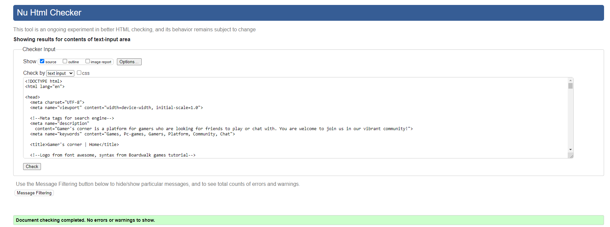

**games.html errors and clearance**

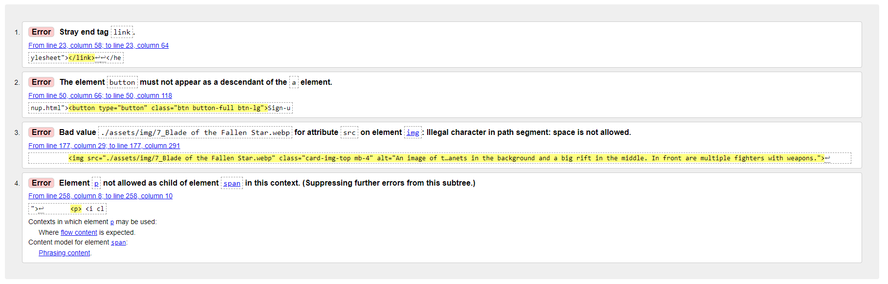

**signup.html errors and clearance**

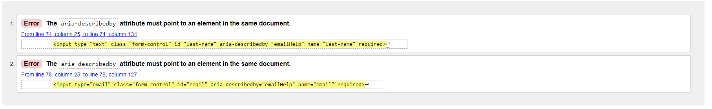

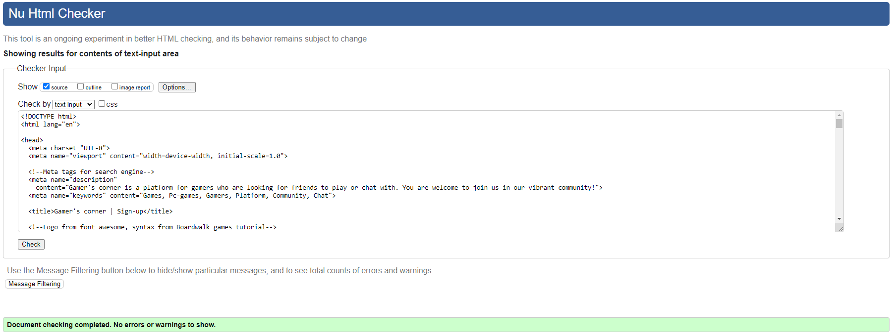

**welcome.html warnings**

- The social links are added for accessibility because the links are only images and not self-explanatory.

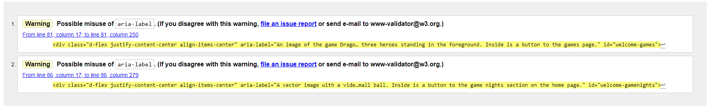

- There were no other warnings or errors.

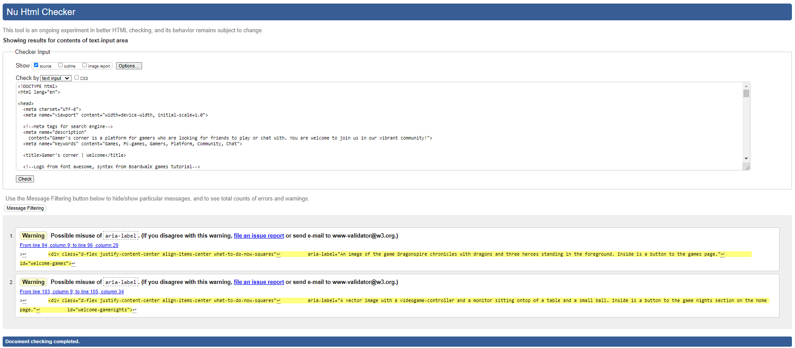

**404.html errors and clearance**

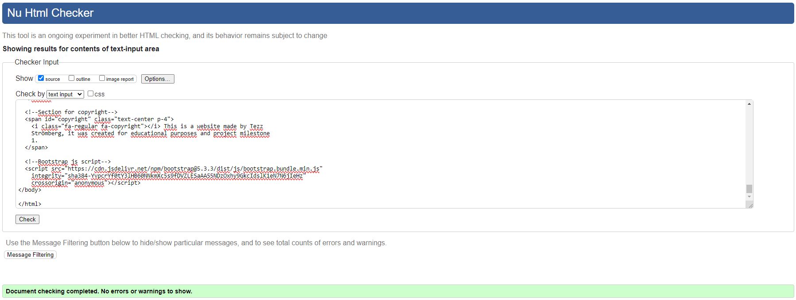

#### CSS

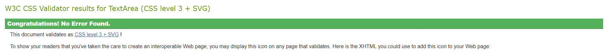

There were some warnings but that was related to the imported fonts and nothing I can control.

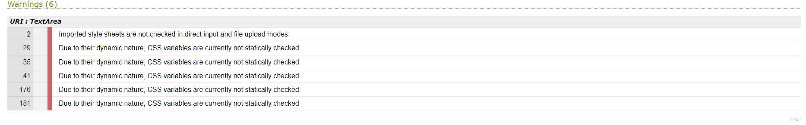

### Lighthouse

- While lighthouse testing there wasn't enough spacing around the buttons so I decided to make it larger to increase the area.

- I missed to add aria-labels to the social links since they don't have any other explanation other than the link text.

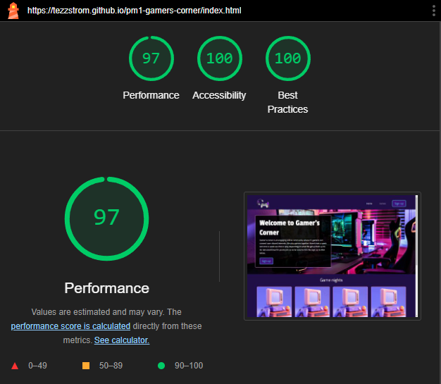

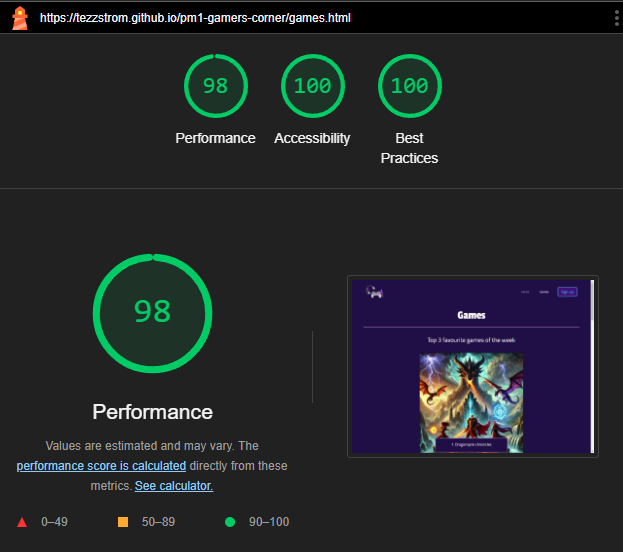

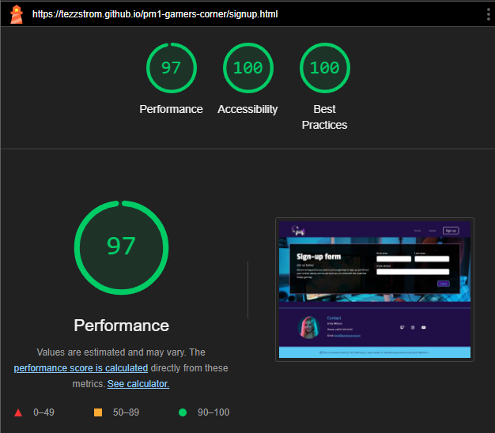

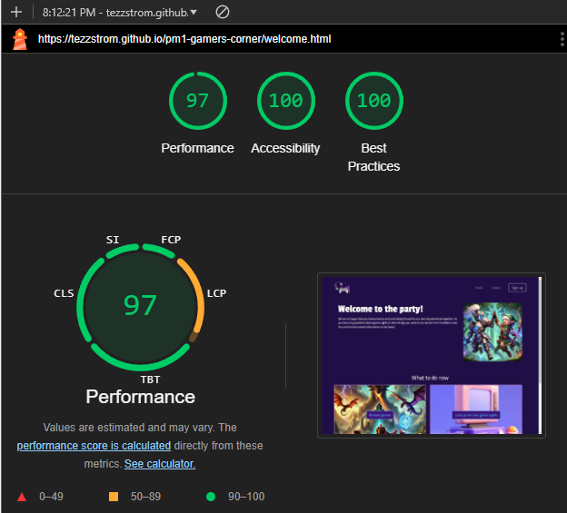

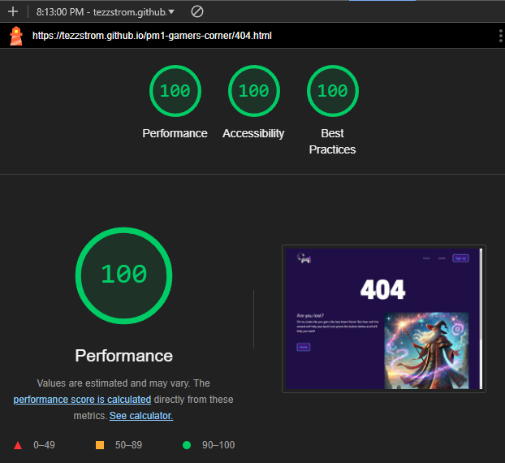

#### Manual-testing

| Feature                          | Expect                                                                            | Action                                                                               | Result                                                                                     |
| -------------------------------- | --------------------------------------------------------------------------------- | ------------------------------------------------------------------------------------ | ------------------------------------------------------------------------------------------ |
| Carousel                         | Carousel should change images when clicking the arrows                            | Clicking the left or right arrow keys in the carousel on the games page              | Image is being changed                                                                     |
| Signup form empty name           | Empty name input should display a warning                                         | Leave name input blank in the signup form on the signup page and click submit        | A warning of "Please fill out this field" is displayed                                     |
| Signup form invalid email adress | Invalid email adress should display a warning                                     | Enter "invalid_email" in the email input field in the signup form on the signup page | A warning of "Please include a '@' in the email address. 'invalid_email' is missing an '@' |
| Mail link in footer              | Clicking the email link in the footer should open the users preferred mail client | On any page, scroll to the footer and click the email link                           | The mail client is opened                                                                  |
| Social links                     | Clicking the twitch.tv social link should open twitch.tv in a new tab             | On any page, scroll to the footer and click the twitch icon                          | twitch.tv is opened in a new tab                                                           |

#### Browser-testing

**Layout:** Make sure the layout looks the same across browsers

**Functionality:** Controll all links, navigation and forms works.

| Browser | Layout               | Functionality |
| ------- | -------------------- | ------------- |
| Chrome  | ✔️                   | ✔️            |
| Firefox | ✔️                   | ✔️            |
| Edge    | ✔️                   | ✔️            |
| Safari  | No access to browser | -             |

#### User-story testing

| Expectation                                                                                                                                               | Result                                                                                                                                                                             |
| --------------------------------------------------------------------------------------------------------------------------------------------------------- | ---------------------------------------------------------------------------------------------------------------------------------------------------------------------------------- |
| As a site owner, I want to increase attendence to game nights.                                                                                            | As a site owner, I can increase attendence through the sign-up form.                                                                                                               |
| As a user, I want easy navigation, a responsive design across devices and a user-friendly interface to avoid frustration when trying to find information. | As a user, I can easily navigate the site through the global navigation bar at the top of the site and I can access the website on all my devices thanks to the responsive design. |
| As a user, I want to find information about upcoming game nights to know whether I can attend.                                                            | As a user, I can find the information about game nights on the home page.                                                                                                          |
| As a user, I want to sign-up for game nights through a form for the events that interest me.                                                              | As a user, I can select what game I want to play in the sign-up form.                                                                                                              |
| As a user, I want to see high-quality pictures of the games and read descriptions.                                                                        | As a user, I can see high-quality images and read descriptions of the games on the games page.                                                                                     |
| As a user, I want to send a message to the site's owner so that I can ask questions about upcoming events or games.                                       | As a user, I can send my questions to the site owner using the email link in the footer.                                                                                           |

### Bugs

**Containers and rows in footer**

- when creating the footer, I had some trouble with how the containers and rows worked together with bootstrap grid. I added a background color to each of the container and rows to sort them out. It was also difficult to add all the col's, gap's and apply margins and paddings but in the end I worked it out.

**Caption text**

- I had troubles with the caption text disappearing on small devices on the carousel. Turned out to be a couple of classes that needed to be changed. I erased the d-none and md so it just says d-block to keep the block but not the grid properties (see the marked part on the second image).

**Gap on cards**

-When I tried to give the cards on the game page a gap they didn't work how I thought they would. Instead of gap the third column was moved to the next row. To solve this, I found on Bootstrap that they need to be in another div with just the column properties.

_Problem_

_Solution_

**Sign-up-button**

- While I validated and changed the html code, the sign-up button changed. It turns out that the nav-link was the issue so I erased that.

_Problem_

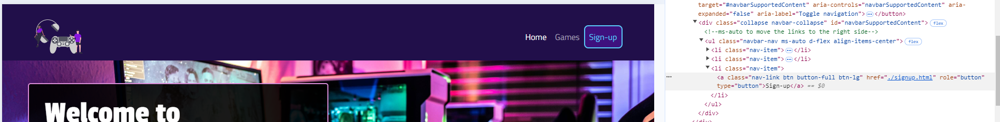

_Solved_

**Prettier added slashes to the end of some tags**

- While I validated and changed the html code, I saw some new warnings about slashes at the end of my meta-, link-, and img-tags, etc. To disable this I found a guide on stackoverflow about using another formatter.

_Solution_

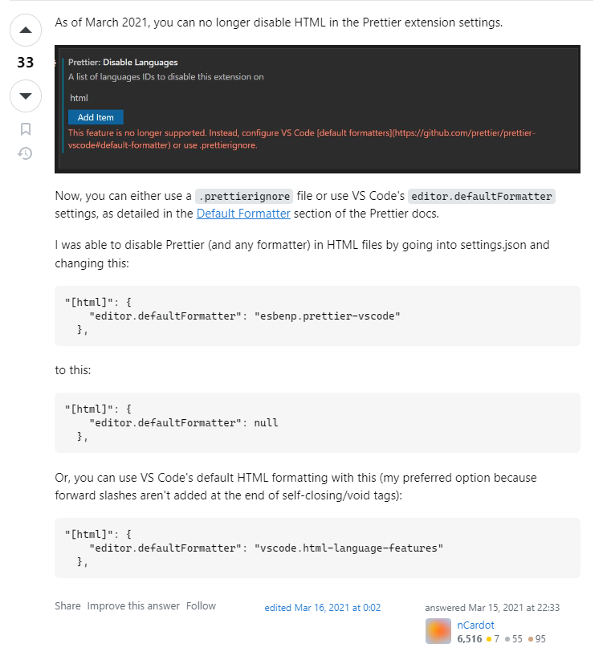

---

## Deployment

- when I were done with the index.html I added all the remaining changes, committed and pushed to GitHub. I decided to deploy early since it's recommended from the tutorials provided by the Code Institute. It's easier to compare both the local and the live to discover bugs or other problems early.

1. Add, commit and push everything to GitHub.

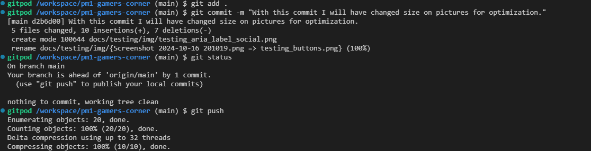

2. Go to the repositories site and press on settings.

3. Press the pages in the left panel.

4. Choose source (deploy from branch) and then choose main and save.

5. Go in to the actions tab and wait for it to finish processing.

6. Go back to the <>code page, find the deployed site and press the link.

7. Click the link to ensure that the link works and that everything looks good (which it did).

---

## Future improvements

- After talking to my mentor, we decided that I should leave out the vote function (see wireframes games page) since I have yet to learn the functionality behind that type of data. I would like to implement it later though because of the improved UX, the user is involved in decision making about what games to play.

- A future improvement that could improve UX and accesibility to the website is to add a background behind the buttons in the carousel since they are not clearly visible at the moment.

---

## Credits

### Media

| Source                                   | Location                    | Type                   | Notes                                                                    |
| ---------------------------------------- | --------------------------- | ---------------------- | ------------------------------------------------------------------------ |
| [Freepik](https://www.freepik.com/)      | images, portrait            | images                 | This website was used to download images to the site.                    |
| [Font awesome](https://fontawesome.com/) | Icons/Head icon             | Icons                  | Used to insert icons.                                                    |
| [UnDraw](https://undraw.co/search)       | Logo                        | Image                  | Used UnDraw to find a logo.                                              |
| [Unsplash](https://unsplash.com/)        | hero background             | Image                  | Used UnDraw to find a logo.                                              |
| [ChatGPT](https://chatgpt.com/)          | game images and description | Images and description | To produce the images and the description for the games, I used ChatGPT. |

### Challenges

| Source                                                                                                                    | Location   | Type                                   | Notes                                                                                                |
| ------------------------------------------------------------------------------------------------------------------------- | ---------- | -------------------------------------- | ---------------------------------------------------------------------------------------------------- |
| [Youtube](https://www.youtube.com/watch?v=qVvcPoAj_-w)                                                                    | git        | git reset --hard <SHA>                 | I accidentally copied the wrong SHA so I followed this tutorial to undo the reset.                   |
| [Stackoverflow](https://stackoverflow.com/questions/35868756/how-to-make-bootstrap-cards-the-same-height-in-card-columns) | Cards      | Height                                 | To make the cards on the game page the same height I used align-items-stretch from Stackoverflow.    |
| [Youtube (Kevin Powell)](https://www.youtube.com/shorts/hk3RgcBx5Fc)                                                      | a-tag link | Scroll down to section from other page | I used this video to figure out how to scroll down the index.html from an a-tag on the welcome page. |
